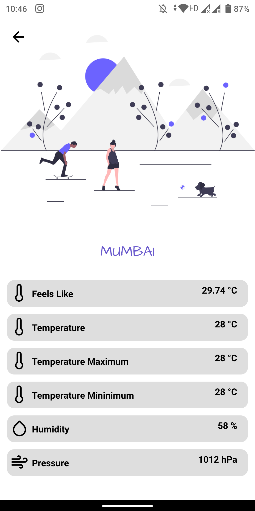

# Current Weather Native Application

An application which takes city/country from user as input and returns weather information of that particular place such as temperature, humidty, etc.

Built using React Native.
Information is gathered using Open Weather API.

# Output

# Splash Screen

# Home Screen

# Result Screen
